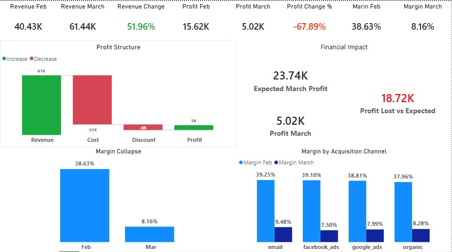

# Revenue Growth, Profit Collapse – Unit Economics Diagnostic

A full end-to-end business investigation using SQL (PostgreSQL) for structured economic analysis and Power BI for executive reporting.

This analysis was conducted to investigate a critical divergence:

- Revenue increased significantly.
- Profit declined sharply.
- Margin collapsed.

The objective was to identify the structural drivers of profitability deterioration and provide a clear executive-level recommendation.

---

## Business Context

In March, revenue increased substantially compared to February.

However:

- Profit declined by 68%.
- Gross margin dropped from 38.6% to 8.2%.

The CFO requested a full diagnostic review to determine:

- Why revenue growth did not translate into profit
- Whether the issue was segment-specific or systemic
- What financial impact occurred
- What corrective actions are required

Available datasets:

- `users`
- `sessions`
- `orders`
- `events`

---

## Analytical Framework

The investigation was structured around unit economics:

> **Profit = Revenue − Cost − Discount**

The analysis followed a systematic diagnostic approach:

1. KPI validation  
2. Profit decomposition  
3. Segment validation (channel, country, device)  
4. Financial impact quantification  
5. Executive framing  

This ensured movement from high-level financial outcome to root cause identification.

---

## KPI Validation

March vs February:

- Revenue: +52%
- Profit: −68%
- Margin: 38.6% → 8.2%
- Orders increased
- AOV increased

Revenue growth was confirmed.  
Profit deterioration was material and structural.

---

## Economic Decomposition

Despite higher order volume and improved AOV:

- Cost ratio increased from 59.9% to 82.3%
- Discount ratio increased from 1.5% to 9.5%
- Margin compressed by over 30 percentage points

Revenue expansion was absorbed by cost and discount expansion.

The issue was not demand generation —  
it was economic structure deterioration.

---

## Segment Validation

Margin collapse was observed:

- Across all acquisition channels
- Across all countries
- Across both desktop and mobile devices

Revenue mix remained relatively stable.

This confirms:

- No channel-specific inefficiency
- No regional anomaly
- No device-related technical issue

The margin collapse was systemic.

---

## Financial Impact

If March had maintained February cost structure:

- Expected profit ≈ 23.7k
- Actual profit = 5.0k
- Estimated lost profit ≈ 18.7k

Approximately 19k in profit erosion occurred due to structural cost and discount changes within one month.

This represents material financial damage.

---

## Root Cause

Profit collapse was primarily driven by:

- Significant cost inflation
- Aggressive discount expansion

Not by:

- Traffic decline
- Conversion drop
- Revenue contraction

The issue is located in unit economics.

---

## Recommended Action

Immediate review required in the following areas:

- Supplier pricing and cost drivers
- Operational expense structure
- Discount and promotion strategy

Priority objective:

> Restore margin from ~8% toward historical 35–40% range

Short-term actions may include:
- Temporary discount tightening
- Cost structure audit
- Margin monitoring by segment

---

## Tools Used

- PostgreSQL
- SQL (CTEs, aggregation, window functions)
- Power BI
- DAX measures
- Structured unit economics framework

---

## Power BI Dashboard Structure

The analysis was translated into a single executive dashboard designed for immediate financial clarity.

### 1. Executive Diagnostic Page

Purpose:  
Provide clear visibility into what happened, why it happened, and how severe the financial impact is.

The dashboard includes:

#### 2. KPI Overview (Top Section)

This section establishes the magnitude of the issue:
Revenue growth combined with severe margin collapse.

---

#### 3. Profit Structure (Waterfall)

This visual shows how revenue growth was absorbed by:

- Increased cost structure
- Expanded discount policy

---

#### 4. Financial Impact

This section quantifies material financial damage and translates margin compression into monetary impact.

---

#### 5. Margin Collapse Comparison

This visual isolates the core issue: efficiency deterioration.

---

#### 6. Margin by Acquisition Channel

Margin February vs Margin March by channel.

---

## What This Case Demonstrates

- Structured KPI validation
- Unit economics decomposition
- Margin compression analysis
- Segment confirmation logic
- Financial impact quantification
- Executive-level business communication